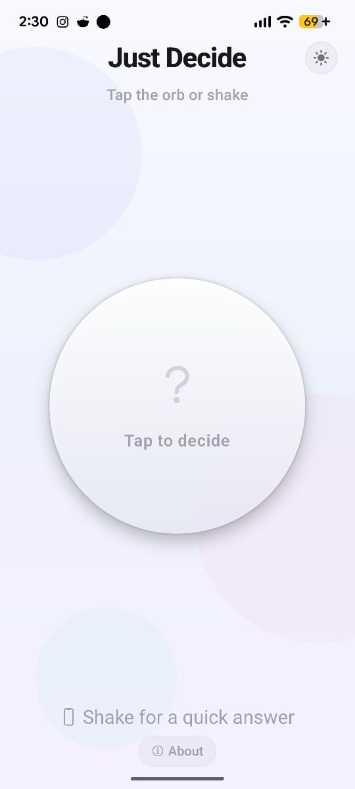
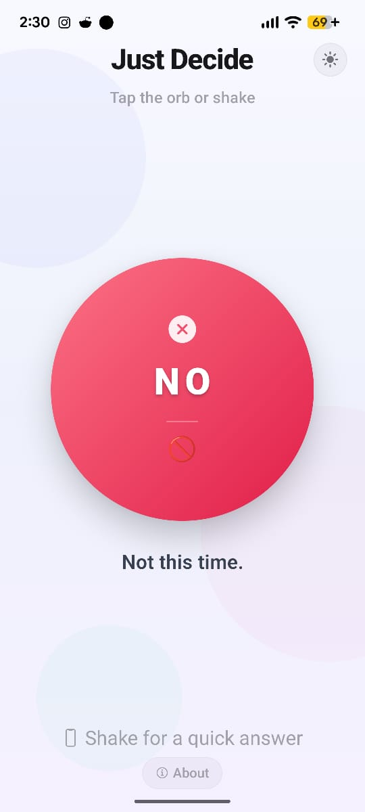
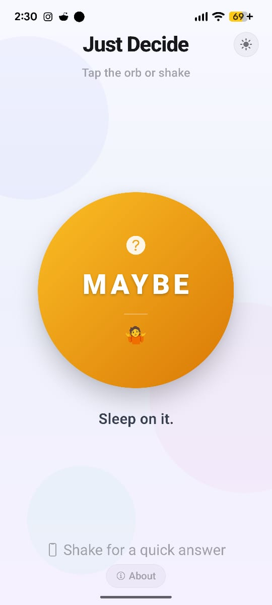
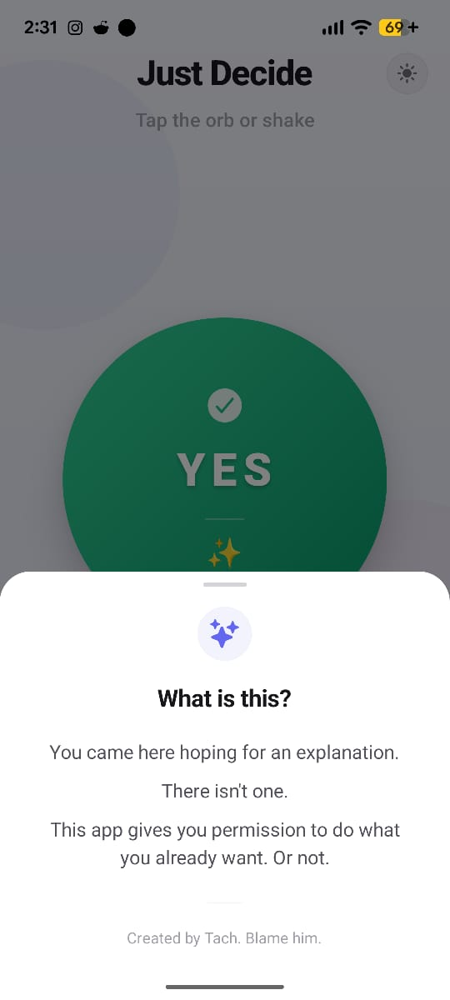

# Just Decide

A mobile app that helps you make decisions by shaking your phone. Built with Expo and React Native.

<div style="display: flex; flex-wrap: wrap; gap: 8px; margin: 16px 0;">
  
  
  
  
  
</div>

## How it works

Just Decide uses your device's accelerometer to detect a shake. When you shake your phone, the app animates a decision card that lands on one of three outcomes: YES, NO, or MAYBE. Each outcome includes haptic feedback and a unique visual treatment.

- **YES** triggers confetti and a heavy haptic pulse
- **NO** delivers a warning notification
- **MAYBE** responds with a medium haptic tap

A cooldown period prevents accidental repeated shakes.

## Features

- Shake-to-decide using the device accelerometer
- Animated card with shake, spin, pulse, and slide effects
- Haptic feedback for each outcome type
- Confetti celebration on YES results
- Dark and light theme support (auto-switches based on system preference, or manual toggle)
- About bottom sheet with app information

## Tech stack

- [Expo](https://expo.dev) with SDK 56
- [Expo Router](https://docs.expo.dev/router/introduction) for file-based navigation
- [react-native-reanimated](https://docs.swmansion.com/react-native-reanimated) for animations
- [expo-haptics](https://docs.expo.dev/versions/latest/sdk/haptics) for haptic feedback
- [expo-sensors](https://docs.expo.dev/versions/latest/sdk/sensors) for accelerometer input
- [react-native-confetti-cannon](https://github.com/vibes0389/react-native-confetti-cannon) for confetti effects
- [@gorhom/bottom-sheet](https://github.com/gorhom/react-native-bottom-sheet) for the about panel

## Getting started

### Prerequisites

- [Bun](https://bun.sh) (or npm)
- [Expo CLI](https://docs.expo.dev/get-started/installation)

### Install dependencies

```bash
bun install
```

### Start the app

```bash
bun start
```

Scan the QR code with Expo Go on your phone, or press `a` for Android emulator / `i` for iOS simulator.

### Build for production

```bash
npx expo export
```

## Project structure

```
app/
  _layout.tsx        Root layout with theme and navigation providers
  index.tsx          Main decision screen
assets/
  images/
    screenshots/     App store screenshots
    icon/            App icons for Android and iOS
contexts/
  theme-context.tsx  Dark/light theme context provider
```
